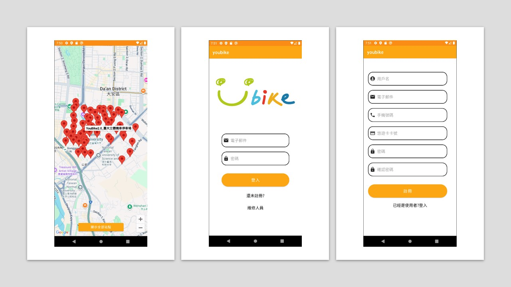

# YouBike Android Application

本專案為示範性的 YouBike 租借/地圖顯示 Android App，包含使用者登入、維修人員登入、地圖站點顯示、站點清單、加值等功能。專案已封裝主要邏輯，提升維護性。並提供能夠運行於安卓手機 APK 檔提供下載（init release）



## 主要特色
- Google Map 顯示站點標記與點擊導向站點詳情
- 站點清單 RecyclerView 與顯示切換
- 使用者登入/註冊、餘額加值
- 維修人員登入（預設密碼 6666 ）
- 程式封包：地圖、資料存取、導覽、清單控制抽離

## 環境需求
- Android Studio

## 建置
```bash
./gradlew assembleDebug
# 產出: app/build/outputs/apk/debug/app-debug.apk
```

## 專案結構
本專案主要程式邏輯統一在'app/src/main/java/com/example/youbike/'目錄下，以下說明各檔案用途：
```
.
├── MainActivity.java                     # 主組裝與導覽（AppBar/Drawer/NavController）
├── NavigationHandler.java                # 側邊欄點擊導覽
├── db/
│   └── DatabaseHelperMap.java            # 地圖站點/車柱 SQLite 結構與初始化
├── domain/
│   └── StationRepository.java            # 匯入 assets→DB、查詢站點清單
├── feature/
│   ├── map/
│   │   └── MapController.java            # 地圖渲染、Marker 互動、跳轉詳情
│   └── list/
│       ├── Station.java                  # 站點資料模型
│       ├── StationAdapter.java           # 站點列表 Adapter
│       └── StationListController.java    # RecyclerView 綁定/顯示切換
├── data/
│   ├── LoginDataSource.java              # 使用者資料查詢（SQLite）
│   ├── LoginRepository.java              # 登入資料倉儲
│   └── model/LoggedInUser.java           # 使用者模型
├── ProfileActivity.java                  # 使用者個資顯示
├── LoginActivity.java                    # 使用者登入
├── SignupActivity.java                   # 使用者註冊
├── MaintenanceLoginActivity.java         # 維修登入
├── StationDetailsActivity.java           # 站點詳情頁
├── VehicleDispatchActivity.java          # 車輛調度
└── VehicleStatusActivity.java            # 車輛狀態查詢/更新
```

其他重要目錄'app/src/main/'：
```
.
├── assets/                               # 站點/車樁 JSON
└── res/
    ├── layout/                           # XML 版面
    ├── menu/                             # 主選單與側欄選單
    ├── values/                           # colors/strings/themes
    └── navigation/mobile_navigation.xml  # NavGraph
```

### 模組關係說明
- `MainActivity`：組裝 UI 與控制器，負責導覽/注入。
- `domain/StationRepository`：資料層入口，負責 assets→DB 匯入與站點查詢。
- `db/DatabaseHelperMap`：資料表結構與初始化（站點/車樁）。
- `feature/map/MapController`：地圖與 Marker 行為，InfoWindow 點擊跳 `StationDetailsActivity`。
- `feature/list/*`：列表 UI 封裝，`StationListController` 控制顯示切換。
- `data/*`：使用者資料查詢與登入流程封裝。

# 使用工具與套件
## 開發與建置
- Android Studio
- Gradle 8.4
- Android Gradle Plugin
- Java 17
- 資料繫結：ViewBinding、DataBinding

## Android/Jetpack 依賴
- appcompat
- material
- activity
- constraintlayout
- navigation-fragment
- navigation-ui

## Google 服務
- play-services-maps（Google Maps）

##JSON 與資料處理
- Gson（com.google.code.gson:gson）

# 開發人員
本專案為國立臺灣大學工程科學及海洋工程學系「物件導向程式語言」課程之期末專題作業，開發人員如下表：
|NTU, Dept. of ESOE|NTU, Dept. of ESOE|NTU, Dept. of ESOE|NTU, Dept. of ESOE|
| ------------- |---------------| ------------- |---------------|
|TSOU, FU-CHIEN|WU, WEI-TA|WANG, LU-HENG|LIU, WEI-FENG|